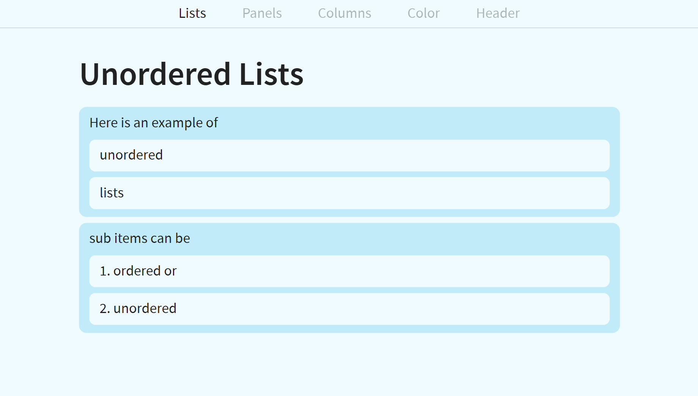
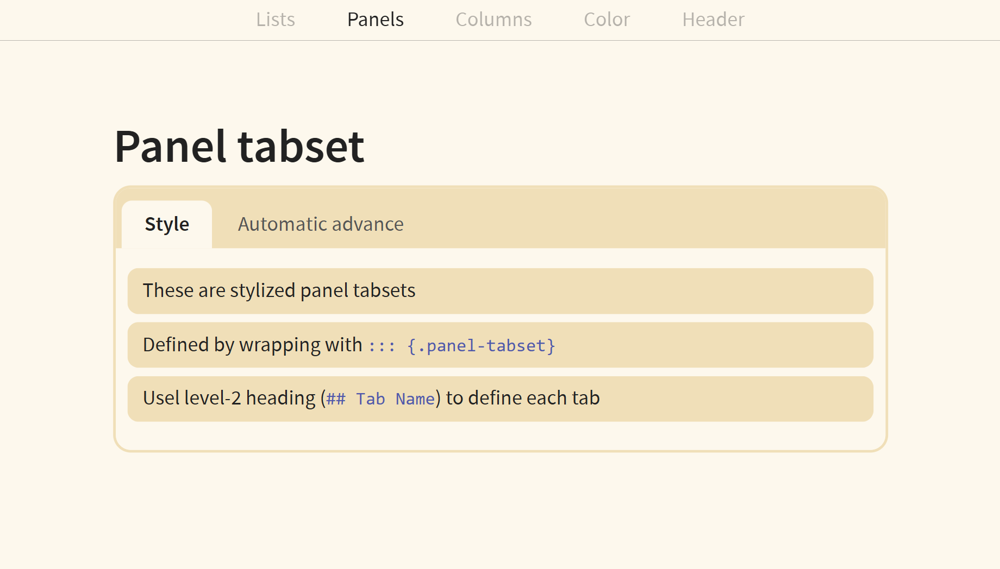
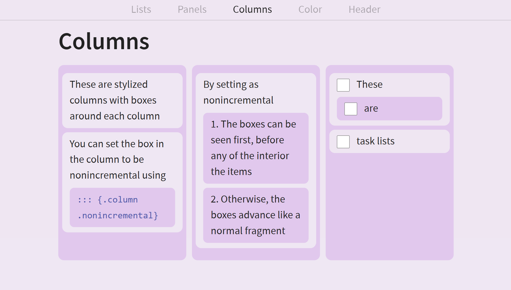

# Containers Theme

A Quarto Reveal.js extension that provides styled card-based presentations with rounded corners, tabsets, columns, and background color persistence.

## Example







See [example.qmd](example.qmd) for source and [example.html](example.html) for rendered presentation.

## Features

- Card-styled lists with rounded corners and colored backgrounds
- Centered card lists for focus slides
- Normal (browser-default) lists for standard content
- Styled panel tabsets with rounded tab buttons
- Equal-height columns with card-style wrappers
- Background color persistence across slides
- Secondary colors automatically calculated from background

## Styling

### Default List Style: Card Lists

Lists are styled as rounded cards with colored backgrounds. The secondary color is calculated from the slide background using OKLCH color space.

- First-level items: Slightly darker/saturated
- Nested items: Same as slide background

### Centered Card Lists

```markdown
::: card-list-center
- First item
- Second item
:::
```

### Normal Lists

```markdown
::: normal-list
- Bullet list
1. Numbered list
- [ ] Task list
:::
```

### Panel Tabsets

```markdown
:::::: {.panel-tabset}

## Tab 1

Content

## Tab 2

Content

::::::
```

### Columns

Columns automatically get equal-height card styling. Use `.nonincremental` to show immediately:

```markdown
:::::: columns

::::: {.column width="33%" .nonincremental}

Content

:::::

:::::
```

## Background Color Persistence

Background colors set on any slide **persist forward** to all subsequent slides until a new background is set:

```markdown
# Section {background-color="peach"}
## This slide is peach
## Still peach (inherits)
## New section {background-color="cream"}
## This slide is cream
```

Default is white if no background color is set for the title slide or any given slide. 

## Extensions

This theme works with bundled Quarto extensions:

- [simplemenu](https://github.com/Martinomagnifico/quarto-simplemenu) - Header menu navigation
- [tabset](https://github.com/mcanouil/quarto-revealjs-tabset) - Panel tabsets

## Installation

Use the format directly in your Quarto document. Replace where you would normally put `revealjs`:

```yaml
format:
  containerstheme-revealjs:
    # options
```

## Configuration

All standard Reveal.js options are supported:

```yaml
format:
  containerstheme-revealjs:
    center: true
    touch: true
    incremental: true
    smaller: true
    transition: slide
    section-divs: false
    menu: false
```

## Credits

- Author: Mona Xue
- [simplemenu](https://github.com/Martinomagnifico/quarto-simplemenu)
- [tabset](https://github.com/mcanouil/quarto-revealjs-tabset)